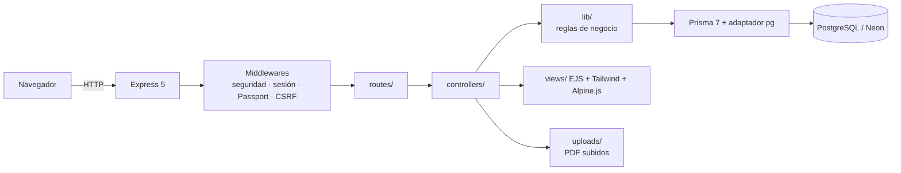

# Compliance AI · RGPD + ENS

## 1. Descripción general del proyecto

Compliance AI es una plataforma web para gestionar el cumplimiento del Reglamento General de
Protección de Datos (RGPD) y del Esquema Nacional de Seguridad (ENS) en una organización.

En muchas organizaciones ese cumplimiento se lleva en hojas de cálculo y documentos dispersos,
sin control de los plazos legales ni una visión de conjunto del estado de cada sistema.

Está dirigida a delegados de protección de datos, responsables de seguridad y de cumplimiento, y
administradores de organizaciones sujetas al RGPD y al ENS.

Lo que la distingue:

- **RGPD y ENS en torno al sistema de información:** actividades de tratamiento, riesgos,
  incidentes, solicitudes de derechos, evaluaciones ENS y procesos de continuidad se asocian a un
  sistema o quedan como transversales.
- **Panel de control con las acciones pendientes ordenadas por urgencia**, para toda la
  organización o para un sistema concreto.
- **Avisos automáticos de plazos legales:**
  - 72 horas para notificar una brecha a la AEPD;
  - un mes para responder a los derechos;
  - revisión periódica de las políticas;
  - pruebas de continuidad en los últimos 12 meses.
- **Declaración de Conformidad del ENS** generada a partir de una evaluación, versionada y con su
  documento PDF.

## 2. Stack tecnológico utilizado

Versiones instaladas según `package-lock.json`.

### Backend

| Tecnología | Versión | Para qué se usa en este proyecto |
|---|---|---|
| Node.js | ^20.19, ^22.12 o ≥ 24 (`engines`) | Ejecuta el servidor; es la versión mínima que exige Prisma 7. |
| Express | 5.2.1 | Servidor HTTP: un router por módulo, middlewares, archivos estáticos y manejo de errores (`app.js`). |
| multer | 2.4.0 | Recibe en memoria los PDF subidos a proveedores, derechos y políticas, con un máximo de 10 MB (`lib/subidas.js`). |
| pdfkit | 0.20.2 | Genera el PDF de la Declaración de Conformidad (`lib/pdfDeclaracion.js`) y los PDF de ejemplo de las políticas. |
| dotenv | 18.0.4 | Carga la configuración del archivo `.env`: conexión a la base de datos, secreto de sesión… |

### Base de datos y ORM

| Tecnología | Versión | Para qué se usa en este proyecto |
|---|---|---|
| PostgreSQL | — (no fijada en el proyecto) | Base de datos relacional (`provider = "postgresql"` en `prisma/schema.prisma`). |
| Neon | — | Alojamiento de PostgreSQL en la nube. `prisma.config.js` quita el «-pooler» de la URL para que las migraciones no se bloqueen. |
| Prisma (CLI) | 7.10.0 | Esquema de 25 modelos, 21 migraciones, generación del cliente y ejecución del seed. |
| @prisma/client | 7.10.0 | Consultas desde controladores y `lib/`, con un único cliente compartido (`lib/prisma.js`). |
| @prisma/adapter-pg | 7.10.0 | Conecta Prisma 7 a PostgreSQL con el driver `pg` y un pool de hasta 20 conexiones. |

### Frontend

| Tecnología | Versión | Para qué se usa en este proyecto |
|---|---|---|
| EJS | 6.0.1 | Plantillas de las pantallas, renderizadas en el servidor (`views/`). |
| Tailwind CSS | 4.3.3 | Estilos. La configuración está en `src/styles/input.css` y se compila a `public/css/output.css`. |
| Alpine.js | 3.x por CDN (jsDelivr; hoy sirve la 3.17.4) | Interactividad en el navegador: menús desplegables, pestañas, secciones plegables del panel y mostrar u ocultar la contraseña. |
| Lucide (`lucide-static`) | 1.48.0 | Iconos SVG que el servidor incrusta en el HTML (`lib/iconos.js`). |
| Inter (`@fontsource-variable/inter`) | 5.3.0 | Tipografía servida desde el propio servidor en `/fuentes`. |

### Autenticación y seguridad

| Tecnología | Versión | Para qué se usa en este proyecto |
|---|---|---|
| Passport | 0.7.0 | Inicio de sesión y recuperación del usuario en cada petición (`config/passport.js`). |
| passport-local | 1.0.0 | Estrategia de acceso con email y contraseña. |
| express-session | 1.19.0 | Sesión en la cookie `sid`: 8 h, HttpOnly, SameSite=Lax y Secure en producción. |
| bcryptjs | 3.0.3 | Hash de las contraseñas (coste 12) y comprobación en el login. |
| Middleware propio | — | `middlewares/seguridad.js`: cabeceras de seguridad (CSP, X-Frame-Options…), protección CSRF y límite de intentos de login, sin dependencias externas. |

### Herramientas de desarrollo

| Tecnología | Versión | Para qué se usa en este proyecto |
|---|---|---|
| @tailwindcss/cli | 4.3.3 | Compila los estilos (`npm run build:css` y `npm run watch:css`). |
| `node --watch` | la de Node.js | Reinicia el servidor al cambiar el código (`npm run dev`). |
| Pruebas propias (`tests/`) | — | Batería funcional con el `fetch` de Node, sin framework de tests; incluye copia y restauración de los datos (`npm test`). |

El proyecto no tiene configuración de linters, formateadores, Docker ni despliegue.

### Entorno de desarrollo y control de versiones

| Herramienta | Para qué se ha usado en este proyecto |
|---|---|
| Visual Studio Code | Editor de código principal: edición, terminal integrada y ejecución de la aplicación en local. |
| Git y GitHub | Control de versiones y alojamiento del repositorio del proyecto. `.gitattributes` fija el fin de línea LF de las migraciones. |

### Herramientas de IA utilizadas

| Herramienta | Para qué se ha usado en este proyecto |
|---|---|
| Claude Code (Anthropic) | Asistente de programación dentro del proyecto: generación y refactorización de código, pruebas de funcionamiento, comentarios del código y redacción de la documentación a partir del código real. |
| Claude (Anthropic) | Apoyo fuera del código: preparación de los prompts de trabajo y de una infografía del funcionamiento de la aplicación. |

Todo el código y la documentación generados con IA han sido revisados y validados por el autor.

Aplicación web para gestionar en un solo sitio el cumplimiento del **Reglamento General de
Protección de Datos (RGPD)** y del **Esquema Nacional de Seguridad (ENS, RD 311/2022)** de una
organización, tomando el **sistema de información** como eje: cada actividad de tratamiento,
riesgo, incidente, solicitud de derechos, evaluación ENS o proceso de negocio puede asociarse a
un sistema o ser transversal a toda la organización.

Proyecto desarrollado como Trabajo Fin de Máster. [COMPLETAR: máster, universidad y curso]

## Módulos

| Área | Módulo | Ruta |
|---|---|---|
| General | Panel de control (global o por sistema) | `/dashboard` |
| General | Sistemas de información | `/sistemas` |
| RGPD | Actividades de tratamiento (RAT, art. 30) | `/rat` |
| RGPD | Evaluación de riesgos | `/riesgos` |
| RGPD | Incidentes y brechas (arts. 33-34, plazo de 72 h) | `/incidentes` |
| RGPD | Derechos de los interesados (art. 12, plazo de un mes) | `/derechos` |
| RGPD | Proveedores / encargados del tratamiento (art. 28) | `/proveedores` |
| ENS | Catálogo de controles (solo Administrador) | `/controles` |
| ENS | Evaluaciones ENS (checklist por sistema) | `/evaluaciones/:id` |
| ENS | Declaraciones de Conformidad (con PDF) | `/declaraciones` |
| ENS | Políticas y documentación (con aceptación por los usuarios) | `/politicas` |
| ENS | BIA y continuidad | `/bia` |
| Administración | Datos de la empresa | `/empresa` |
| Administración | Usuarios (solo Administrador) | `/usuarios` |
| Público | Aviso legal, Política de privacidad y Política de cookies (sin iniciar sesión) | `/aviso-legal`, `/privacidad`, `/cookies` |

Todas las pantallas, incluido el login, tienen un pie con los enlaces a las tres páginas legales. Esas páginas indican que la web y sus datos son **ficticios** (proyecto académico); los datos del titular se cambian en un solo sitio, [config/legal.js](config/legal.js).

El detalle funcional está en [docs/PRD.md](docs/PRD.md) y el técnico en
[docs/ARQUITECTURA.md](docs/ARQUITECTURA.md).

## Cómo está construida



- **Servidor:** Node.js, Express 5, sesiones con `express-session` y autenticación con Passport (estrategia local, contraseñas con bcrypt).
- **Datos:** PostgreSQL (en desarrollo, Neon) con Prisma 7 y el adaptador `@prisma/adapter-pg`.
- **Interfaz:** vistas EJS renderizadas en el servidor, estilos con Tailwind CSS 4, interacciones ligeras con Alpine.js e iconos Lucide.
- **Documentos:** PDF subidos con multer (validados por su firma) y PDF de las declaraciones generados con pdfkit.

## Requisitos

- Node.js **20.19 o superior** (o 22.12+ / 24+), que es lo que exige Prisma 7.
- Una base de datos **PostgreSQL**, local o en la nube (p. ej. Neon).
- npm (viene con Node.js).

## Instalación

```bash
git clone [COMPLETAR: URL del repositorio]
cd tfm-rgpd-ens
npm install                      # instala dependencias y genera el cliente de Prisma (postinstall)
cp .env.example .env             # y rellena al menos DATABASE_URL y SESSION_SECRET
npx prisma migrate deploy        # crea las tablas
npm run build:css                # compila los estilos (public/css/output.css no está en git)
npm run db:ejemplo -- --confirmar  # datos de demostración (o «npm run seed» para empezar vacío)
npm run dev                      # http://localhost:3000
```

En Windows, en lugar de `cp` usa `copy .env.example .env`.

## Comandos

| Comando | Qué hace |
|---|---|
| `npm run dev` | Arranca el servidor y lo reinicia al cambiar el código (`node --watch`). |
| `npm start` | Arranca el servidor (producción). |
| `npm run build:css` / `npm run watch:css` | Compila Tailwind una vez / en modo vigilancia. |
| `npm run prisma:migrate` | Crea y aplica una migración nueva en desarrollo (`prisma migrate dev`). |
| `npx prisma migrate deploy` | Aplica las migraciones pendientes (instalación, otro equipo, producción). |
| `npm run prisma:generate` | Regenera el cliente de Prisma. |
| `npm run seed` (o `npm run prisma:seed`) | Carga mínima: administrador inicial y 12 controles ENS básicos. No borra nada. |
| `npm run db:ejemplo -- --confirmar` | **Borra los datos** (salvo las cuentas existentes) y carga la empresa de ejemplo. Bloqueado con `NODE_ENV=production`. |
| `npm run db:copia` | Copia de seguridad de todos los datos en `backups/copia-AAAAMMDD-HHMMSS.json`. |
| `npm run db:restaurar -- <copia.json> --confirmar` | Restaura una copia (**borra los datos actuales**). |
| `npm run db:descripciones` | Rellena la descripción de los controles del Anexo II que no la tengan. |
| `npm run db:pdfs-politicas` | Genera un PDF de ejemplo para las políticas que aún no tienen documento vigente (lo ejecuta también `db:ejemplo`). |
| `npm test` | Batería de pruebas funcionales (ver «Pruebas»). |

## Variables de entorno

Se leen del archivo `.env` (plantilla en [.env.example](.env.example)).

| Variable | Obligatoria | Uso | Por defecto |
|---|---|---|---|
| `DATABASE_URL` | sí | Conexión a PostgreSQL que usa la aplicación (en Neon, la del pooler). | — |
| `SESSION_SECRET` | sí | Firma de la cookie de sesión; sin ella la app no arranca. | — |
| `DIRECT_URL` | no | Conexión directa para las migraciones. | `DATABASE_URL` sin «-pooler» |
| `PORT` | no | Puerto HTTP. | `3000` |
| `NODE_ENV` | no | `production` activa la cookie segura (HTTPS) y la confianza en el proxy, y bloquea `db:ejemplo` y `npm test`. | — |
| `UPLOADS_DIR` | no | Carpeta de los PDF subidos. | `uploads/` |
| `SEED_ADMIN_EMAIL` | no | Email del administrador que crea `npm run seed`. | `admin@test.com` |
| `SEED_ADMIN_PASSWORD` | no | Su contraseña (mínimo 12 caracteres); si falta, se genera y se muestra una vez. | aleatoria |
| `TEST_URL` | no | Dirección de la app para `npm test`. | `http://localhost:3000` |

## Credenciales de demostración

Solo existen si se cargan los datos de ejemplo (`npm run db:ejemplo -- --confirmar`). Son
**solo para pruebas**: nunca las uses en un entorno real.

| Usuario | Contraseña | Rol |
|---|---|---|
| `admin@test.com` | `admin1234` | Administrador |
| `elena.martin@labfarmareunidos.example`, `javier.ortega@…`, `marta.quintero@…` | `Ejemplo2026` | Administrador |
| `carmen.vidal@labfarmareunidos.example`, `andres.pena@…`, `lucia.fernandez@…`, `pablo.rubio@…`, `sergio.navas@…` | `Ejemplo2026` | Usuario |

La empresa de ejemplo («Laboratorios Farmacéuticos Reunidos») y todas las personas son ficticias.

## Estructura del proyecto

```text
app.js            Entrada del servidor: configuración de Express y montaje de rutas
config/           Passport (login y sesión), roles, bases legales y datos de las páginas legales
middlewares/      Control de acceso (auth.js) y seguridad: cabeceras, CSRF, límite de login
routes/           Una ruta por módulo (URL → controlador y permisos)
controllers/      Lógica de cada pantalla: lee la petición, valida, consulta y pinta la vista
lib/              Reglas de negocio y utilidades compartidas (plazos, % ENS, riesgo, PDF…)
views/            Plantillas EJS por módulo y partials/ comunes
src/styles/       Hoja de estilos de Tailwind (se compila a public/css/output.css)
public/           Archivos estáticos (CSS compilado, logo)
prisma/           Esquema, migraciones, seeds y scripts de datos (copia, restauración…)
tests/            Pruebas funcionales (npm test)
docs/             PRD, arquitectura y plan del proyecto
uploads/          PDF subidos (no se versiona)
backups/          Copias de seguridad de los datos (no se versiona)
```

## Pruebas

`npm test` ejecuta 262 pruebas funcionales con peticiones HTTP reales: acceso, roles, los diez
módulos, cálculos, panel y seguridad.

1. **Requisitos:** la aplicación tiene que estar en marcha (`npm run dev`) y los datos de ejemplo cargados.
2. **Antes de empezar:** el script hace una **copia de seguridad**.
3. **Durante las pruebas:** se crean, editan y borran registros.
4. **Al terminar:** **restaura** la copia y borra los archivos de prueba de `uploads/`, aunque alguna prueba falle.
5. **Resultados:** el detalle queda en `tests/resultados.json`.

Úsalo contra una base de datos de desarrollo o de pruebas, nunca contra producción.
El informe de la última revisión completa está en [INFORME_PRUEBAS.md](INFORME_PRUEBAS.md).

## Problemas frecuentes al instalar

| Síntoma | Causa y solución |
|---|---|
| `Error: Falta SESSION_SECRET en el .env` | No existe `.env` o le falta la variable: copia `.env.example` y rellénala. |
| La web se ve sin estilos | `public/css/output.css` no se versiona: ejecuta `npm run build:css`. |
| `Cannot read properties of undefined` sobre un modelo (p. ej. `prisma.organizacion`) | El cliente de Prisma no está al día: `npm run prisma:generate`. |
| En Windows, `prisma generate` falla con `EPERM` | El servidor tiene abiertos los archivos de Prisma: páralo, genera y vuelve a arrancar. |
| `prisma migrate dev` pide hacer *reset* por un *checksum* distinto | Se ha editado una migración ya aplicada. No se tocan: deshaz el cambio y crea una migración nueva. Los finales de línea de las migraciones están fijados en `.gitattributes`. |
| `prisma migrate dev` dice que el entorno no es interactivo | Ocurre en algunas terminales: aplica con `npx prisma migrate deploy` (o crea la migración a mano). |
| Las migraciones se quedan bloqueadas con Neon | El pooler retiene el bloqueo de Prisma: usa la conexión directa (`DIRECT_URL`, ver `prisma.config.js`). |
| Aviso `SECURITY WARNING: The SSL modes 'prefer', 'require'…` | Es solo un aviso del driver `pg`. Para quitarlo, usa `sslmode=verify-full` en `DATABASE_URL`. |
| `EADDRINUSE` al arrancar | Ya hay otro proceso en el puerto 3000: ciérralo o cambia `PORT`. |

## Cookies

La aplicación solo usa elementos técnicos, por lo que no muestra banner de consentimiento:
- la cookie de sesión `sid`, que se crea al iniciar sesión y dura 8 horas;
- una entrada de almacenamiento local que recuerda las secciones desplegadas del panel.

Sin sesión no se crea ninguna cookie. El detalle está en [/cookies](http://localhost:3000/cookies) y en `config/legal.js`. Si se añadiera una cookie no técnica (por ejemplo, de analítica), habría que pedir consentimiento antes de instalarla y actualizar esa página.

## Documentación

- [docs/PRD.md](docs/PRD.md): requisitos del producto, roles y reglas de negocio.
- [docs/ARQUITECTURA.md](docs/ARQUITECTURA.md): capas, recorrido de una petición, modelo de datos y decisiones técnicas.
- [docs/PLAN.md](docs/PLAN.md): fases del proyecto, lo hecho y lo pendiente.
- [CHANGELOG.md](CHANGELOG.md): historial de cambios.
- [CLAUDE.md](CLAUDE.md) / [AGENTS.md](AGENTS.md): guía para asistentes de programación.

## Licencia

[MIT](LICENSE) © 2026 José María de Paz Siles
