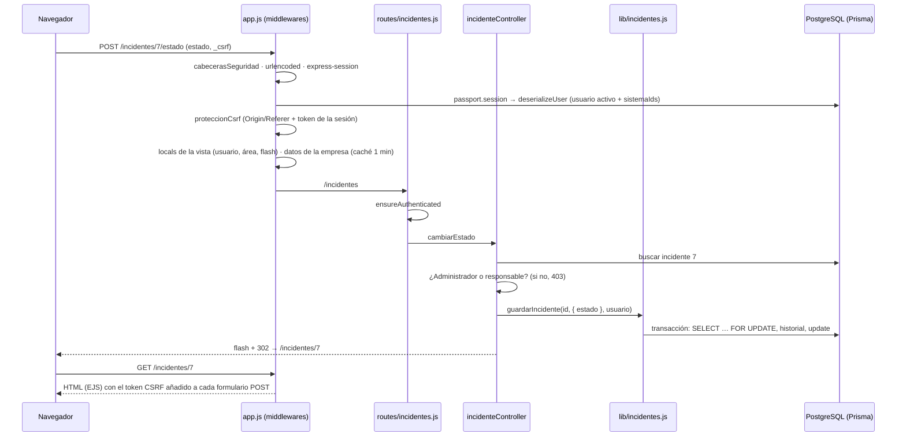
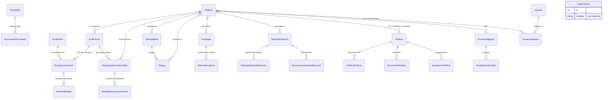
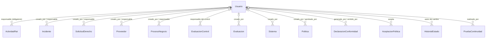

# Arquitectura · Compliance AI

Descripción técnica redactada a partir del código. Las decisiones llevan el motivo que figura en
los comentarios del propio código; donde el código no lo explica, está marcado como [COMPLETAR].

## 1. Capas

Es una aplicación monolítica con renderizado en el servidor (MVC sin framework adicional):

| Capa | Carpeta | Responsabilidad |
|---|---|---|
| Entrada | `app.js` | Crea la app Express. Registra middlewares globales, helpers de vistas (`app.locals`), las rutas de cada módulo, el 404 y el manejador de errores. |
| Configuración | `config/` | Passport (estrategia local, serialización de la sesión), roles, bases legales y datos de las páginas legales (`legal.js`). |
| Middlewares | `middlewares/` | `auth.js`: exigir sesión, rol de Administrador o ausencia de sesión. `seguridad.js`: cabeceras HTTP, CSRF y límite de intentos de login. |
| Rutas | `routes/` | Un `express.Router` por módulo: asocian método y URL a una acción y aplican `ensureAuthenticated` / `ensureAdmin`. |
| Controladores | `controllers/` | Leen y validan la petición, comprueban permisos finos (Administrador o responsable), llaman a Prisma o a `lib/` y responden con una vista o una redirección. |
| Lógica de negocio | `lib/` | Reglas y cálculos reutilizables: plazos, % ENS, nivel de riesgo, métricas del panel, PDF, subidas, permisos, validación y fechas. |
| Acceso a datos | `lib/prisma.js`, `prisma/` | Cliente único de Prisma 7 sobre PostgreSQL, con esquema y migraciones. |
| Presentación | `views/`, `src/styles/`, `public/` | Plantillas EJS por módulo (`index`, `show`, `form`) y `partials/`. Tailwind compilado a `public/css/output.css`. Alpine.js para pestañas, menús y bloques plegables. |
| Archivos | `uploads/` | PDF subidos (contratos, documentos de derechos, políticas), fuera del repositorio. |

## 2. Recorrido de una petición

Ejemplo: un responsable cambia el estado de un incidente desde su ficha.

Orden de los middlewares en `app.js`:
1. cabeceras de seguridad;
2. lectura del cuerpo;
3. archivos estáticos y fuentes;
4. sesión;
5. Passport;
6. CSRF;
7. variables comunes de las vistas (usuario, ruta, área de color, flash);
8. datos de la organización;
9. rutas;
10. 404;
11. manejador de errores. Un error `P2020` (id fuera de rango) se responde como 404; cualquier otro, como 500 sin traza.

## 3. Modelo de datos

El esquema (`prisma/schema.prisma`) tiene **25 modelos** y **26 enums**, con **21 migraciones**.
Los campos van en snake_case y las tablas en plural (`@@map`). Cada modelo y enum tiene una línea `///`
que lo describe.

### Entidades del dominio

### Relaciones con Usuario (autoría, responsabilidad y aceptación)

### Claves del modelo

- **El sistema como eje:**
  - `sistema_id` es **opcional** en actividades RAT, riesgos, incidentes, solicitudes, políticas y procesos BIA;
  - si es nulo, el registro es **transversal**;
  - al borrar un sistema se pone a nulo (`onDelete: SetNull`).
- **Evaluaciones como foto:**
  - `EvaluacionControl` tiene una fila por control (`@@unique([evaluacion_id, control_id])`);
  - el % se calcula sobre esas filas;
  - un control con filas no se puede borrar del catálogo (`onDelete: Restrict`), salvo si nadie lo ha trabajado (lo borra la aplicación).
- **Declaraciones congeladas:**
  - `DeclaracionConformidad` guarda copia de los nombres (sistema, evaluación, autores) y de los recuentos;
  - `DetalleDeclaracionControl` copia cada control;
  - si después se renombra o se borra algo, la declaración no cambia;
  - un sistema con declaraciones no se puede borrar (`Restrict`).
- **Trazabilidad:**
  - cada cambio de estado se registra en una tabla de historial (`HistorialEstado`, `HistorialIncidente`, `HistorialSolicitudDerecho`);
  - el registro se hace dentro de una transacción con la fila bloqueada.
- **Aceptación de políticas:** `AceptacionPolitica` es única por (política, usuario, versión), así que una versión nueva exige aceptarla de nuevo.
- **Borrados en cascada:** 16 relaciones usan `onDelete: Cascade`, por ejemplo los riesgos de una actividad, el historial de un incidente o los documentos de un proveedor.
- **Autoría:** las relaciones de autoría y responsabilidad usan `SetNull`, así que si desaparece un usuario el registro se conserva. En la práctica los usuarios no se borran: se desactivan (`activo`).
- **Organización:** `Organizacion` es una tabla de una sola fila, sin relaciones: la aplicación no es multiempresa.

## 4. Decisiones técnicas

| Decisión | Motivo (según el código) |
|---|---|
| Prisma 7 con el adaptador `@prisma/adapter-pg` y un pool de hasta 20 conexiones | Prisma 7 se conecta a PostgreSQL con un *driver adapter*; el panel lanza en paralelo una consulta agregada por módulo (`lib/prisma.js`). |
| Migraciones por conexión directa (`prisma.config.js`, `DIRECT_URL`) | Con el pooler de Neon, el bloqueo de Prisma Migrate puede quedarse retenido y bloquear las siguientes migraciones. |
| Migraciones con LF fijo (`.gitattributes`) y nunca editarlas | Prisma compara el checksum de cada migración aplicada; un cambio de bytes obliga a resetear la base de datos. |
| Sistema de información como eje, con asociación opcional | Une RGPD y ENS en una sola ficha sin obligar a clasificar lo transversal (`lib/sistemas.js`). |
| Panel calculado con consultas agregadas en paralelo (`count(*) FILTER`) | Evitar una consulta por sistema (N+1); la vista general y la de un sistema salen del mismo resultado (`lib/panel.js`, `lib/dashboard.js`). |
| Cambios de estado en transacción con `SELECT … FOR UPDATE` | Que dos cambios simultáneos registren bien el estado anterior en el historial (`lib/incidentes.js`, `lib/derechos.js`, `lib/evaluaciones.js`). |
| Evaluaciones y declaraciones como fotos fijas | Que una evaluación cerrada o una declaración emitida no cambie al modificar el catálogo (`lib/evaluaciones.js`, comentarios del esquema). |
| Nivel de riesgo, plazos y % ENS calculados en el servidor | El nivel nunca se toma del formulario (`riesgoController.js`); los plazos usan la hora de España (`lib/formato.js`). |
| Fechas en hora de España, independientemente del servidor | Los plazos legales (72 h, un mes) y las fechas de los formularios deben ser los de España (`lib/formato.js`). |
| Seguridad propia en `middlewares/seguridad.js` (cabeceras, CSRF, límite de login) | Equivalente reducido a helmet, sin dependencias. El token CSRF se inyecta en todos los formularios al renderizar. |
| PDF validados por su firma y guardados con nombre aleatorio fuera de `public/` | No fiarse de la extensión ni del tipo declarado; el nombre del usuario nunca toca el disco (`lib/subidas.js`). |
| Tipografía Inter servida desde el propio servidor | No enviar las IP de los usuarios a terceros, como haría Google Fonts (`app.js`). |
| Iconos Lucide incrustados como SVG desde el servidor | Una sola librería, sin dependencias en el navegador (`lib/iconos.js`). |
| Versión del CSS por fecha de modificación | Que el navegador no siga usando una hoja antigua de su caché (`app.js`). |
| Datos de la organización en caché de 1 minuto | Se muestran en todas las pantallas; la caché caduca para ver los cambios hechos fuera de la app (`lib/organizacion.js`). |
| Usuarios desactivados en vez de borrados | Conservar su historial; un desactivado pierde la sesión (`config/passport.js`). |
| Datos de las páginas legales en un único archivo (`config/legal.js`) | Cambiar titular, DPD, encargados, plazos o cookies sin tocar las vistas; los datos son ficticios (proyecto académico). |
| Páginas legales públicas y pie común en todas las vistas (`partials/pie.ejs`) | Son accesibles sin sesión y desde cualquier pantalla, incluido el login. Sin sesión no se crea cookie (`saveUninitialized: false`). |
| Solo cookies técnicas, sin banner de consentimiento | La sesión (`sid`) y una preferencia de la interfaz en almacenamiento local están exentas (art. 22.2 LSSI-CE). El token CSRF se guarda en la sesión, no en otra cookie. |
| Copias de seguridad en JSON con Prisma | Sin necesidad de `pg_dump` (`prisma/copia-seguridad.js`). |
| Renderizado en el servidor (EJS) con Alpine.js para la interactividad | [COMPLETAR: motivo de elegir SSR en lugar de una SPA] |
| PostgreSQL en Neon | [COMPLETAR: motivo de elegir Neon] |

## 5. Limitaciones conocidas

Están anotadas en el código con «FALLO DETECTADO» y resumidas en [PLAN.md](PLAN.md):
- las sesiones se guardan en memoria (MemoryStore);
- los plazos no se trasladan a días hábiles;
- al generar un borrador de declaración, la declaración emitida vigente pasa ya a «Superada»;
- otras de menor impacto.
